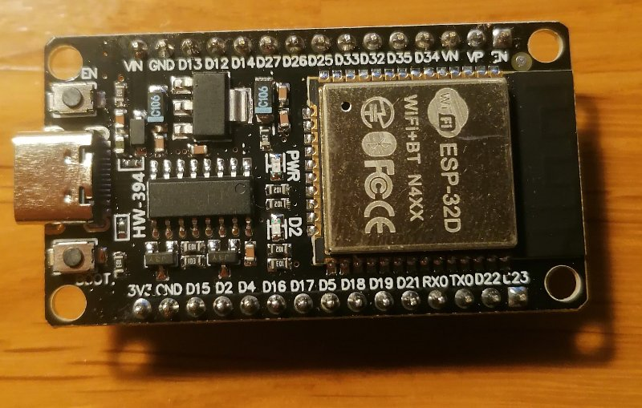
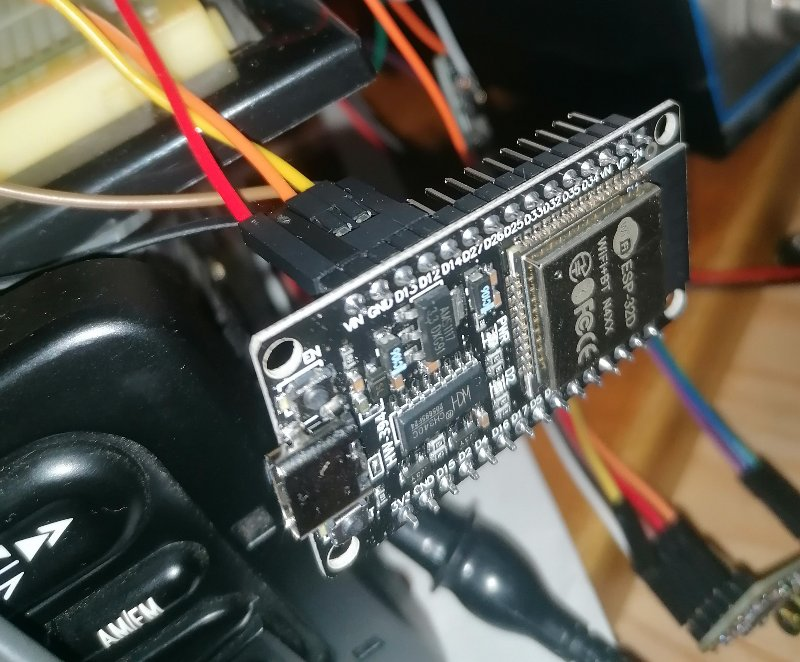
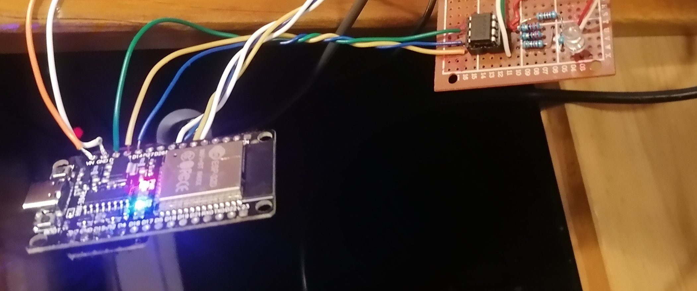

# Bluetooth Adapter for the 1997-2007 Ford 3000,4000,5000 ... RDS Ford Radio Series via CD changer emulator using ESP32

Want to connect your youngtimer radio to your mobile ? This repo provides the software to use a ESP32 dev kit for emulating a CD changer module. It sets up bluetooth sink / receiver that your mobile phone can connect to to play music. 

### Software basis

This is a port of Anson Lius great [FordACP-AUX](https://github.com/ansonl/FordACP-AUX) project to the ESP32 / ESPSoftwareSerial platform - continuing a long line of tinkering with the ACP protocol. See the other sources in the License section below.

### Why another ESP32 version - pros / cons
A central motivation for this project was that the commercial solution I was using for this purpose suffered - at least in my specific set-up - from disconnects between the Radio and ACP CD emulator, that would result in the CD emulator not being recognised even after restarting the radio. 

The goal was to build a solution that provided the greatest control over 
* the ACP communication between the emulator and radio,
* the bluetooth audio connection (e.g. choice of radio bluetooth ID),
* the current developer's understanding of the cod,
* portability.

The ESP32 platform is currently cheap and accessible through many dev-kits and solutions for [A2DP bluetooth](https://github.com/pschatzmann/ESP32-A2DP) audio are readily available. This seemed like a great opportunity to own the bluetooth communication and get access to music metadata such as playback time, song title, as well as directly communicate playback instructions (pay/pause,stop,seek,volume) between the ESP32 an the mobile phone music source.

Unfortunately, ESP32 does not seem to support the 9-bit serial protocol that is used for the ACP communication between the radio and our ESP32 CD player simulator. Instead, I relied on the [ESPSoftwareSerial](https://github.com/plerup/espsoftwareserial) package that kind implemends and documents 9-bit serial protocols. In the ACP communication, the 9th bit is mostly used to sigify "End of message", so it is necessary to read and set this for making this work. 

#### SoftwareSerial is not as snappy
Unfortunately, the software serial solution is much more costly computation-wise, and this results in the ACP part of this project to be way less snappy than Liu's Arduino Uno solution. Particularly after adding Bluetooth A2DP, the ESP32 is barely able (depending on the model) to respond to ACP messages in time and also manage music playback.

Still the solution just about worked out for me, and will probably improve with the very welcome performance and scheduling enhancements that you may contribute.

#### SoftwareSerial code is approachable and portable
The code in this repo uses only software-serial commands and no ESP32-specific instructions to implement the ACP communication protocol. I hope this may help future ports to newer platforms (looking forward to see an aproachable audio sink for Bluetooth-LE in the newer ESP models). 

Writing this back to a usual serial package also helped me debug the ACP handshake fails and how to recover from them. In short, re-sending the first ACP handshake response will trigger a successful handshake after communication loss - in my use-case with the RDS5000 radio.

### Functional changes

#### ACP handshake recover method
This repo adds a handshake recover, which helps the ESP32 and the Radio to regain communication without restarting either device. This has only been tested in a limited scope for the RDS5000 radio.

Initially, the implementation just detected a series of handshakes that look fine on the wire but are not remembered/recognised by the Radio. It would then restart the ESP32 until the handshakes turn effective again. 

The current implementation does not need a ESP32 restart but merely repeats the first ACP response - repeating this until handshakes recover. 

#### Handshake recover as device by itself
You may want to just implement the above solution in a smaller ESP32-C3 package, and let this fix the communication with an exiting Bluetooth audio-ACP solution by sniffing and interjecting the additional Handshake response to the ACP bus.

ACP-, ACP+, differential signals of the repeated handshake response (green), then radio continuing the protocol successully. 

#### Bluetooth audio
The ESP32 will be handling this, and you will be in full control of the audio and meta-data that is sent from the phone. Note that the ESP32 is loaded heavily with this, and some of the ESP32 devices I tested were not able to reproduce audio without clicks and gaps. Using a separate bluetooth audio decoder may be an option to avoid this.

#### CD playback time display
This is a regression from the Arduino Uno solution: I did not succeed in reliably sending the playback time every second - this would lead to dropouts on the audio/bluetooth bus. 

Experiments showed that communicating the CD playback time to the Radio seems necessary as otherwise connections seem to drop after 10-20 minutes of playback. To avoid this, this implemenation adds the current CD playback time to the response to the radio's CD status request - which results in a compromise that seems to keep the communication stable enough.

### Used Hardware
As main components, this project uses
* an ESP32 (with classic bluetooth) for ACP and Bluetooth A2DP sink. Note only the original ESP32 board supports bluetooth classic with A2DP.
* an PCM5102A DAC converter dev board for audio output - it may be possible to use the ESP DAC, but the PCM5102 output sounds great ;),
* an [MAX485](https://www.analog.com/en/products/max485.html) transceiver to electrically implement the ACP protocol.

#### ESP32 Hardware / Dev Boards 
The final prototype was made using a USB-C ESP32-WROOM-DA "SP32 30-Pin Development Board SP32 CH340 USB-C WiFi BT ESP-WROOM 32" dev board as shown below. There was wide variation of bluetooth reception and I2S dropouts across devices. Another micro-usb connector ESP32-WROOM-DA board had to be discarded as there were performance and bluetooth reception issues. Thus I strongly recommend starting with the board as shown below:

If only ACP communication is required, and you outsource the bluetooth audio to an external board, you can use e.g. an ESP-C3 for the ACP. For most of the development cycle, I used the CAREDUINO Esp32-C model, which can use the multi-colour LED for debugging.

### Notes on Electronics
For the electronics implementation I took greatest inspiration from [Krysztof Pintscher](https://www.instructables.com/Ford-CD-Emulator-Arduino-Mega/). Some observations:
* Powering up the RDS5000 radio needs all the power (including backlight) connectors to be connected. If this is not the case, the radio restarts after inputting the RDS Security pin/code.
* Audio Capacitors: The ACP audio input is differential, and the signal 0 appears offset by about 5V. Using capacitors helps, but I found that both the negative and positive audio signals needed decoupling to avoid clicks when changing volume. Maybe someone that knows differential audio can shed some light on this.  
* MAX485 - The dev-boards with the chip have a 120Ohm resistor between ACP+ and ACP- - althought this is standard for the RS-485 protocol, I am not sure if it is expected in ACP. In my case, this resistor was loading the ACP line too heavily and reducing the signal significantly.  
* PCM5102A There is [ample documentation](https://github.com/probonopd/MiniDexed/discussions/521) around this chip and the related devboards. Check it out to save yourself some headaches.

Some experiment snapshots:

ESP32 with connected PCM5102A 
Testing setup ESP32 with connected MAX485 and termination resistors on ACP side. PCM5102A connected on underside of ESP32

### License

Any adaptation of this work must comply with licenses of previous works and include references to the previous authors. 
  - Andrew Hammond
  - [Krysztof Pintscher](http://www.instructables.com/id/Ford-CD-Emulator-Arduino-Mega/)
  - [Dale Thomas](http://www.instructables.com/id/Ford-Bluetooth-Interface-Control-phone-with-stock-/)
  - [Anson Liu](http://ansonliu.com) (MIT License)
  - [Daniel Wolff](https://github.com/wolffd/) (MIT License)

### Disclaimer 
Note that this is a hobbyist project and proceed at your own risk. 